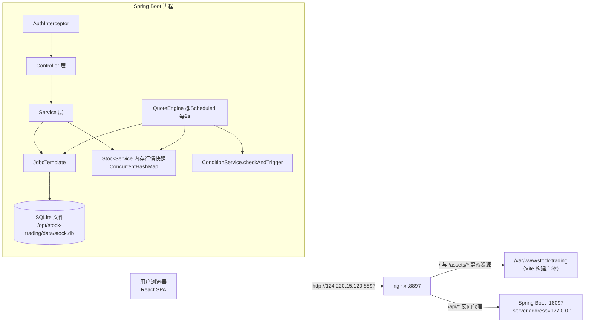
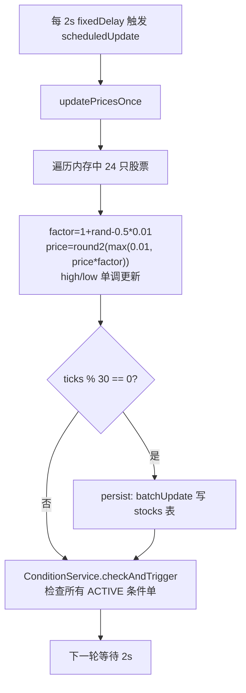
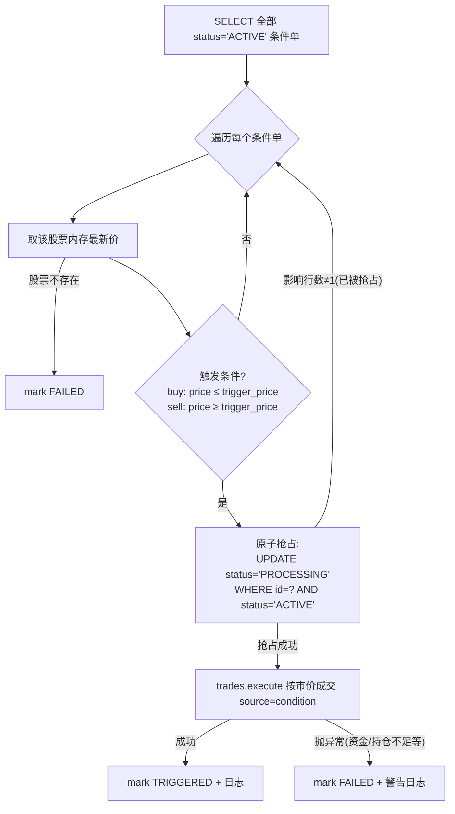

# 股票模拟盘交易系统 · 技术设计文档

| 项目 | 内容 |
| --- | --- |
| 文档版本 | 1.0 |
| 编写日期 | 2026-09-02 |
| 代码基线 | 仓库 `renlg/stock-trading-simulator`，commit `6471098`（main 分支） |
| 分析方式 | 只读分析 `backend/` 与 `web/` 全部源码、`deploy.sh`、配置文件与测试代码，未修改任何源文件 |
| 线上环境 | http://124.220.15.120:8897（nginx 反代 → 后端 18097，前端静态 `/var/www/stock-trading`） |

> 说明：本文所有结论均来自代码实际实现，关键结论以 `文件路径:行号` 或方法名标注出处；与任务需求描述不一致之处统一汇总于附录 A。

---

## 1. 系统概述

### 1.1 目标

一个**自包含、零外部依赖**的 A 股模拟盘交易系统，供学习与演示使用：

- 用户使用**虚拟资金**注册账户，在模拟行情中练习交易策略，无真实资金风险（`backend/README.md:3`）。
- 内置模拟行情引擎：不连接真实行情源，24 只内置 A 股按随机游走模型每 2 秒更新价格（`backend/README.md:3`）。
- 支持市价买卖、持仓与资金统计、条件单自动触发，并向外部程序提供 API Key 鉴权的 REST 接口（`/api/v1/**`）。

### 1.2 范围

| 能力 | 实现位置 |
| --- | --- |
| 用户注册 / 登录 / 当前用户信息 | `backend/.../auth/AuthController.java`、`AuthService.java` |
| 模拟行情（24 只种子股、随机游走、定时更新） | `backend/.../stock/QuoteEngine.java` |
| 市价买卖（资金校验、持仓维护、订单落库） | `backend/.../trade/TradeService.java` |
| 持仓与资金统计 | `backend/.../account/AccountService.java` |
| 条件单（创建 / 列表 / 取消 / 自动触发） | `backend/.../condition/ConditionService.java` |
| API Key（生成 / 脱敏列表 / 删除 / 鉴权） | `backend/.../apikey/ApiKeyService.java` |
| 订单历史分页查询 | `backend/.../account/AccountService.java:52` |
| Web 前端（8 个页面） | `web/src/pages/*` |
| 一键部署脚本 | `deploy.sh` |

### 1.3 非目标

- **不连接真实行情源**、不对接券商、不发生任何真实交易（`backend/README.md:3,128`）。
- 不提供模拟撮合（订单簿）、无涨跌停、无 T+1、无手续费/印花税、无最小交易单位（100 股）的服务端强制校验——均为市价即时成交（见第 5 章）。
- 不做多租户权限分级、审计日志、资金流水对账、消息推送。
- 不构成投资建议（`backend/README.md:128`）。

### 1.4 技术栈与选型理由

| 层 | 技术 | 版本 | 出处 |
| --- | --- | --- | --- |
| 后端语言 | Java | 17 | `backend/pom.xml:18` |
| 后端框架 | Spring Boot | 3.2.12 | `backend/pom.xml:8` |
| 构建 | Maven（spring-boot-maven-plugin 3.2.5） | - | `backend/pom.xml:50-53` |
| 数据库 | SQLite（org.xerial:sqlite-jdbc） | 3.46.1.0 | `backend/pom.xml:32-33` |
| 数据访问 | spring-boot-starter-jdbc + JdbcTemplate（**不用 JPA/Hibernate**） | - | `backend/pom.xml:26-29` |
| 密码哈希 | spring-security-crypto（仅 BCrypt，唯一安全依赖） | 6.2.4 | `backend/pom.xml:35-39` |
| 前端框架 | React + TypeScript | 18.3.1 / 5.6.3 | `web/package.json:8-21` |
| 前端构建 | Vite | 5.4.11 | `web/package.json:15-21` |
| UI 组件 | Ant Design 5（+ @ant-design/icons） | 5.22.7 / 5.6.1 | `web/package.json:8-9` |
| HTTP 客户端 | axios | 1.7.9 | `web/package.json:10` |
| 路由 | react-router-dom | 6.28.0 | `web/package.json:13` |

**选型理由（结合代码印证）：**

1. **SQLite + JdbcTemplate**：系统定位为单机自包含部署（部署目录 `/opt/stock-trading`，见第 9 章），SQLite 免数据库服务运维；JdbcTemplate 下 SQL 完全透明，便于实现行情批量 UPDATE（`QuoteEngine.persist`）、条件单原子抢占（`ConditionService.checkAndTrigger`）等精确控制。代价是并发写能力弱（SQLite 文件锁），第 10 章给出加固建议。
2. **仅引入 spring-security-crypto 而非完整 Spring Security**：系统只需求"密码哈希"一个安全能力（`AuthService.java:21`），鉴权逻辑（token/API Key 双通道）用自定义 `HandlerInterceptor` 即可覆盖，避免引入完整的过滤器链复杂度。
3. **行情常驻内存、定期落库**：交易按"最新模拟价"即时成交要求读行情零延迟，`StockService` 用 `ConcurrentHashMap` 保存内存快照（`StockService.java:15`），SQLite 仅承担重启恢复，每 30 tick 批量写回。
4. **React 18 + Ant Design 5**：后台型管理页面（表格、表单、弹窗、统计卡）组件成熟；axios 拦截器统一注入 token 与处理 401。
5. **systemd + nginx 静态托管**：单机部署的最小运维方案；前端产物 hash 命名天然支持强缓存（见 9.2）。

---

## 2. 总体架构

### 2.1 部署拓扑与请求流转



一次交易请求的完整流转（前端 → nginx → 后端 → SQLite）：

1. 浏览器 `POST /api/trade/buy`，axios 拦截器自动附 `Authorization: Bearer <token>`（`web/src/api/index.ts:5-9`）。
2. nginx 将 `/api/` 前缀请求反代到 `127.0.0.1:18097`（nginx 配置不在仓库内，见 9.2）。
3. `AuthInterceptor.preHandle` 校验凭证：URI 以 `/api/v1/` 开头则按 API Key 鉴权，否则按登录 token 鉴权，通过后把 `userId` 写入 request 属性（`AuthInterceptor.java:34-37`）。
4. `OrderController.buy` 取出 `userId`（`AuthContext.userId`），委托 `TradeService.execute`。
5. `TradeService` 从内存快照取最新价，扣减资金/维护持仓/写订单，全部在一个 JDBC 事务中完成（`TradeService.java:21-38`）。
6. 统一 `Result{code,message,data}` 经 nginx 返回前端，前端 `getData` 解包（`web/src/utils/index.ts:4-10`）。

### 2.2 后端分层

代码未引入额外抽象层，按 Spring 惯例分为三层，均位于 `backend/src/main/java/com/stocktrade/`：

```
com.stocktrade
├── StockTradeApplication       入口（@EnableScheduling + 预建 data 目录）
├── auth       认证域
│   ├── AuthController          /api/auth/**
│   ├── AuthService             注册/登录/me/token 校验
│   ├── AuthInterceptor         HandlerInterceptor：统一鉴权（token / API Key）
│   └── AuthContext             从 request 取 userId 的静态工具
├── stock      行情域
│   ├── QuoteEngine             @Scheduled 随机游走引擎 + 种子初始化 + 持久化
│   ├── StockService            内存行情快照（ConcurrentHashMap）+ reload/get/all/put
│   ├── StockQuote              record：行情值对象（含 change/changePct 派生）
│   └── QuoteController         /api/quote、/api/quote/{code}、/api/v1/quote/{code}
├── trade      交易域
│   ├── TradeService            execute：市价买卖 + 订单落库（@Transactional）
│   └── OrderController         /api/trade/buy|sell、/api/v1/orders、订单列表
├── condition  条件单域
│   ├── ConditionService        创建/列表/取消/checkAndTrigger（每 tick 触发检查）
│   └── ConditionController     /api/conditions/**
├── account    账户域
│   ├── AccountService          资金统计/持仓明细/订单分页
│   └── AccountController       /api/account、/api/portfolio
├── apikey     API Key 域
│   ├── ApiKeyService           生成（SecureRandom）/脱敏列表/删除/鉴权
│   └── ApiKeyController        /api/apikeys/**
├── config     配置
│   ├── WebMvcConfig            注册 AuthInterceptor 及白名单
│   └── CorsConfig              CORS 规则
└── common     通用
    ├── Result<T>               统一响应包装（record）
    ├── BusinessException       业务异常（携带 HTTP 状态 + 业务码）
    └── GlobalExceptionHandler  @RestControllerAdvice 统一异常转 Result
```

### 2.3 关键架构决策

| 决策 | 实现 | 依据 |
| --- | --- | --- |
| 行情内存常驻 | `StockService.quotes`（`ConcurrentHashMap<String, StockQuote>`），`get()` 直接内存读取 | `StockService.java:15,29-34` |
| 统一响应 | 所有 Controller 返回 `Result<T>`，成功 `code=0, message="成功"` | `Result.java:3-15` |
| 双通道鉴权 | 同一拦截器按 URI 前缀分流：`/api/v1/**` → API Key，其余 → 登录 token | `AuthInterceptor.java:34-35` |
| 行情与条件单解耦 | `QuoteEngine` 通过 `ObjectProvider<ConditionService>` 延迟获取条件单服务（允许缺失），每 tick 末尾触发检查 | `QuoteEngine.java:40,77-78` |
| 单线程调度 | Spring `@Scheduled` 默认单线程调度器，行情 tick 与条件单触发串行执行，无并发 tick | `QuoteEngine.java:63`（若未来扩容线程池，条件单已用原子 UPDATE 抢占兜底，见 5.5） |

---

## 3. 数据模型设计

> 数据库为单文件 SQLite，路径由 `spring.datasource.url=jdbc:sqlite:./data/stock.db` 决定（`application.yml:6`），生产环境为 `/opt/stock-trading/data/stock.db`（见 9.5）。建表语句全部位于 `backend/src/main/resources/schema.sql`，每次启动幂等执行（`application.yml:8-11`，全部使用 `IF NOT EXISTS`）。
>
> **注意：实际为 7 张表**（需求描述中的"6 张表"为笔误，详见附录 A-1）。

### 3.1 ER 总览

```mermaid
erDiagram
    users ||--o{ auth_tokens : "登录产生 token"
    users ||--o{ api_keys : "生成密钥"
    users ||--o{ positions : "持仓"
    users ||--o{ orders : "产生订单"
    users ||--o{ conditions : "设置条件单"
    stocks ||--o{ positions : "行情快照(逻辑引用)"
    stocks ||--o{ orders : "成交标的(逻辑引用)"
    stocks ||--o{ conditions : "触发标的(逻辑引用)"

    users { INTEGER id PK; TEXT username UK; TEXT password_hash; REAL balance; TEXT created_at }
    stocks { TEXT code PK; TEXT name; REAL prev_close; REAL price; REAL high; REAL low; TEXT updated_at }
    positions { INTEGER user_id PK; TEXT code PK; INTEGER quantity; REAL avg_cost; TEXT updated_at }
    orders { INTEGER id PK; INTEGER user_id; TEXT code; TEXT side; REAL price; INTEGER quantity; REAL amount; TEXT status; TEXT source; TEXT created_at }
    conditions { INTEGER id PK; INTEGER user_id; TEXT code; TEXT type; REAL trigger_price; INTEGER quantity; TEXT status; TEXT created_at; TEXT triggered_at }
    auth_tokens { TEXT token PK; INTEGER user_id; TEXT created_at; TEXT expires_at }
    api_keys { INTEGER id PK; INTEGER user_id; TEXT name; TEXT api_key UK; TEXT created_at; TEXT last_used_at }
```

要点：

- `users` 与其余 5 张业务表是一对多关系，但**均未声明外键**（SQLite 外键默认关闭，schema 中也无 `FOREIGN KEY`），引用完整性由应用层保证（如 `positions` 删除时按 `user_id+code` 精确匹配）。
- `stocks` 是**行情快照表**：不是用户数据，只存 24 只种子股的最新行情，作为行情引擎的内存恢复源。
- `positions` 以 `(user_id, code)` 为**复合主键**（`schema.sql:35-42`），每用户每股票一行。
- 订单/条件单中的 `code` 是对 `stocks.code` 的逻辑引用，落库时只存代码不存名称；展示时通过内存行情回填名称（`AccountService.java:40-44`）。

### 3.2 表结构明细

#### users — 用户

| 字段 | 类型 | 约束 | 说明 |
| --- | --- | --- | --- |
| id | INTEGER | PK AUTOINCREMENT | 用户编号 |
| username | TEXT | UNIQUE NOT NULL | 登录名，注册时 `trim()` 后入库（`AuthService.java:36-40`） |
| password_hash | TEXT | NOT NULL | BCrypt 哈希（默认强度 10） |
| balance | REAL | NOT NULL DEFAULT 1000000 | 可用资金；实际初始值来自 `stock.initial-balance` 配置（默认 100 万，`application.yml:14`），注册时由 `AuthService` 显式写入 |
| created_at | TEXT | - | `ISO_LOCAL_DATE_TIME` 格式字符串 |

出处：`schema.sql:1-7`、`AuthService.java:39-40`。

#### auth_tokens — 登录令牌

| 字段 | 类型 | 约束 | 说明 |
| --- | --- | --- | --- |
| token | TEXT | PK | 32 位十六进制随机串（`AuthService.randomHex`，由 UUID 128 bit 转 hex） |
| user_id | INTEGER | - | 所属用户 |
| created_at | TEXT | - | 签发时间 |
| expires_at | TEXT | - | 过期时间 = 签发时间 + 7 天（`AuthService.java:55`） |

出处：`schema.sql:9-14`。校验方式为 `WHERE token=? AND expires_at>?`（`AuthService.java:68`）。无吊销/清理机制（见 7.2 风险点）。

#### api_keys — API Key

| 字段 | 类型 | 约束 | 说明 |
| --- | --- | --- | --- |
| id | INTEGER | PK AUTOINCREMENT | - |
| user_id | INTEGER | - | 所属用户 |
| name | TEXT | - | 密钥名称（≤50 字符，`ApiKeyService.java:21-22`） |
| api_key | TEXT | UNIQUE NOT NULL | 32 位十六进制（16 字节 `SecureRandom`），**明文存储**（见 7.3） |
| created_at | TEXT | - | 创建时间 |
| last_used_at | TEXT | - | 最近一次鉴权成功时间（`ApiKeyService.java:53` 每次认证回写） |

出处：`schema.sql:16-23`。

#### stocks — 行情快照

| 字段 | 类型 | 约束 | 说明 |
| --- | --- | --- | --- |
| code | TEXT | PK | 股票代码（如 600519） |
| name | TEXT | - | 股票名称 |
| prev_close | REAL | - | 昨收（种子价），**初始化后不再更新**（见 4.4） |
| price | REAL | - | 最新价（内存权威值，每 30 tick 回写） |
| high | REAL | - | 当日最高价（内存单调维护） |
| low | REAL | - | 当日最低价（内存单调维护） |
| updated_at | TEXT | - | 最近一次价格更新时间 |

出处：`schema.sql:25-33`。

#### positions — 持仓

| 字段 | 类型 | 约束 | 说明 |
| --- | --- | --- | --- |
| user_id | INTEGER | PK（复合） | 用户 |
| code | TEXT | PK（复合） | 股票代码 |
| quantity | INTEGER | - | 持仓数量（股） |
| avg_cost | REAL | - | 加权平均成本（买入时更新，卖出不变） |
| updated_at | TEXT | - | 最近一次变动时间 |

出处：`schema.sql:35-42`。持仓归零时**删除整行**（`TradeService.java:63`）。

#### orders — 订单/成交记录

| 字段 | 类型 | 约束 | 说明 |
| --- | --- | --- | --- |
| id | INTEGER | PK AUTOINCREMENT | 订单号（`last_insert_rowid()` 回填，`TradeService.java:32`） |
| user_id | INTEGER | - | 用户 |
| code | TEXT | - | 股票代码 |
| side | TEXT | - | 方向：`buy` / `sell` |
| price | REAL | - | 成交价（市价即时成交 = 下单时刻内存快照价） |
| quantity | INTEGER | - | 成交数量 |
| amount | REAL | - | 成交金额 = price × quantity |
| status | TEXT | - | 订单状态，当前实现恒为 `SUCCESS`（无失败订单落库） |
| source | TEXT | - | 来源：`web` / `api` / `condition` |
| created_at | TEXT | - | 成交时间 |

出处：`schema.sql:44-55`、`TradeService.java:30-31`。

#### conditions — 条件单

| 字段 | 类型 | 约束 | 说明 |
| --- | --- | --- | --- |
| id | INTEGER | PK AUTOINCREMENT | - |
| user_id | INTEGER | - | 用户 |
| code | TEXT | - | 标的代码 |
| type | TEXT | - | `buy` / `sell` |
| trigger_price | REAL | - | 触发价格（>0 且有限，`ConditionService.java:29-30`） |
| quantity | INTEGER | - | 触发后委托数量（≥1） |
| status | TEXT | - | `ACTIVE` / `PROCESSING` / `TRIGGERED` / `FAILED` / `CANCELLED` |
| created_at | TEXT | - | 创建时间 |
| triggered_at | TEXT | - | 触发（含失败）时间，`mark()` 写入 |

出处：`schema.sql:57-67`、`ConditionService.java:83-85`。

### 3.3 索引设计

| 索引 | 定义 | 服务目标 | 出处 |
| --- | --- | --- | --- |
| idx_tokens_user | `auth_tokens(user_id)` | 按用户反查 token（当前代码未使用，属预留） | `schema.sql:69` |
| idx_api_keys_user | `api_keys(user_id)` | 密钥列表 `WHERE user_id=? ORDER BY id DESC` | `schema.sql:70` |
| idx_orders_user_created | `orders(user_id, created_at DESC)` | 订单分页按用户过滤 | `schema.sql:71` |
| idx_conditions_status | `conditions(status)` | 每 tick 全表扫描 `status='ACTIVE'` 的条件单 | `schema.sql:72` |

两点说明（如实反映现状）：

- 订单查询实际是 `WHERE user_id=? ORDER BY id DESC LIMIT ? OFFSET ?`（`AccountService.java:56-57`），索引的 `user_id` 前缀用于过滤，但排序列 `created_at` 与查询的 `id` 不一致，SQLite 需额外排序；在模拟盘数据量级下无感知，若订单量增长可考虑将索引调整为 `(user_id, id DESC)`。
- `api_keys.api_key` 与 `auth_tokens.token` 均为 PRIMARY KEY / UNIQUE，鉴权查询走主键/唯一索引，是热路径（`ApiKeyService.java:51`、`AuthService.java:68`）。

---

## 4. 行情引擎设计

行情引擎是系统唯一"市场数据源"，全部逻辑位于 `backend/src/main/java/com/stocktrade/stock/QuoteEngine.java`。

### 4.1 种子数据

`SEEDS` 常量内置 24 只 A 股（代码/名称/种子价），覆盖沪深两市常见蓝筹与热门股（`QuoteEngine.java:23-36`），例如：贵州茅台 600519@1700.00、平安银行 000001@10.50、比亚迪 002594@225.00、宁德时代 300750@190.00、京东方A 000725@4.10。

### 4.2 随机游走算法（`QuoteEngine.updatePricesOnce`，:68-79）

对每只股票，每一 tick：

```
factor = 1 + (ThreadLocalRandom.current().nextDouble() - 0.5) * 0.01     // 区间 [0.995, 1.005)，即 ±0.5%
price  = round2( max(0.01, 旧price × factor) )                          // 下限保护 0.01 元
high   = max(旧high, price)                                              // 只增不减
low    = min(旧low, price)                                               // 只减不增
prevClose 保持不变                                                       // 涨跌基准恒为种子价
```

- **舍入**：`round()` 使用 `BigDecimal.setScale(2, RoundingMode.HALF_UP)`，价格保持两位小数（`QuoteEngine.java:90-92`）。
- **涨跌计算**：`StockQuote.change() = price - prevClose`，`changePct() = change / prevClose × 100`（`StockQuote.java:5-7`）。由于 `prev_close` 初始化后不再更新，"涨跌幅"实际是**相对种子价的累计波动**而非当日涨跌。
- 随机数使用 `ThreadLocalRandom`（线程安全、无共享种子竞争）。

### 4.3 调度

- `@Scheduled(fixedDelayString = "${stock.quote.interval-ms:2000}")`（`QuoteEngine.java:63`）：`fixedDelay` 语义为**上一轮执行完成后 2 秒**再执行下一轮，配置项 `stock.quote.interval-ms: 2000`（`application.yml:16-17`）。
- Spring 默认单线程调度器执行，各 tick 串行；`updatePricesOnce()` 同时被单元测试直接调用（`QuoteEngineTest.java:24`）。
- **配置死项**：`application.yml:15` 定义了 `stock.quote.enabled: true`，但代码中没有任何地方读取该开关，行情引擎无条件启动（见附录 A-3）。

### 4.4 持久化策略

- 引擎维护 `AtomicInteger ticks`，每 tick 自增；当 `ticks % persistTicks == 0` 时调用 `persist()`（`QuoteEngine.java:76`），`persist-ticks: 30`（`application.yml:18`）→ **每 30 个 tick（约 60 秒）批量落库一次**。
- `persist()` 使用 `JdbcTemplate.batchUpdate` 对 24 只股票执行 `UPDATE stocks SET price=?,high=?,low=?,updated_at=? WHERE code=?`（`QuoteEngine.java:81-88`）。注意**不写 `prev_close`**（保持种子价）也**不写 `name`**。
- 内存快照（`StockService.quotes`）始终是交易定价的权威数据源；SQLite 只是重启恢复源。代价：进程异常退出时最多丢失最近 30 tick（60 秒）的行情变化。

### 4.5 启动初始化

`@PostConstruct initialize()`（`QuoteEngine.java:52-61`）：

1. 对 24 只种子执行 `INSERT OR IGNORE INTO stocks(...)`，初始 `prev_close = price = high = low = 种子价`；`INSERT OR IGNORE` 保证重复启动不覆盖既有数据（同时意味着后续新增种子股也会在重启时自动补齐）。
2. `stocks.reload()`：清空内存并全量 `SELECT` stocks 表回填（`StockService.java:19-27`）。
3. 日志输出载入股票数。

### 4.6 行情 tick 时序



---

## 5. 交易与资金设计

核心入口 `TradeService.execute(userId, code, side, quantity, source)`，标注 `@Transactional`（`TradeService.java:21-38`），页面买卖与条件单触发、API 下单共用同一实现，仅 `source` 不同（`web` / `api` / `condition`）。

### 5.1 买入流程（`TradeService.buy`，:40-56）

1. **前置校验**（`execute`，:23-25）：`quantity` 必须为 ≥1 的整数（"交易数量必须为正整数"）、`side` 必须为 `buy`/`sell`、`stocks.get(code)` 取内存最新价（股票不存在 → 404 "股票不存在"，`StockService.java:29-34`）。
2. **资金校验**：`amount = price × quantity`；`balance + 1e-8 < amount` 则抛 400 "可用资金不足"（`1e-8` 容差规避浮点误差，:41-42）。
3. **扣减资金**：`UPDATE users SET balance = balance - ? WHERE id=?`（相对扣减，:43）。
4. **持仓维护（均摊成本）**：
   - 无持仓 → `INSERT positions`，`avg_cost = 成交价`（:46-48）；
   - 已有持仓 → `total = 旧数量 + 新数量`，`avg = (旧数量×旧avg_cost + amount) / total` 加权平均后 UPDATE（:50-54）。
5. **订单落库**（`execute`，:30-31）：`INSERT orders(status='SUCCESS', source=...)`，用 `last_insert_rowid()` 回填订单号返回。

### 5.2 卖出流程（`TradeService.sell`，:58-67）

1. 校验持仓：`SELECT quantity FROM positions WHERE user_id=? AND code=?`，无持仓或持有量 < 卖出量 → 400 "持仓不足"（:59-61）。
2. 减少持仓：剩余为 0 则 `DELETE` 整行，否则 UPDATE 数量（:62-65）。**卖出不改变 `avg_cost`**。
3. 增加资金：`UPDATE users SET balance = balance + ?`（:66）。
4. 订单落库同上。

### 5.3 资金恒等式（`AccountService.account`，:19-32）

```
marketValue = Σ(price × quantity)          // 每只持仓按内存最新价估值
totalAssets = balance + marketValue        // 恒等式，:28
totalProfit = Σ((price - avg_cost) × quantity)   // 全部为浮动盈亏，未实现"已实现盈亏"分笔
```

- 持仓明细同时输出 `profitPct = (price-avg_cost)/avg_cost × 100`（:46）。
- 该恒等式成立的前提是：买入扣款金额与卖出回款金额都等于 `price×quantity`（无手续费），且持仓成本按加权平均维护。`TradeServiceTest` 验证了买卖后资金与持仓的精确一致（`TradeServiceTest.java:37-58`）。

### 5.4 条件单触发机制（`ConditionService.checkAndTrigger`，:61-81）

行情引擎**每个 tick** 末尾调用（`QuoteEngine.java:77-78`）：



关键设计点：

- **触发方向**：买入条件单 `现价 ≤ 触发价` 成交，卖出条件单 `现价 ≥ 触发价` 成交（:69，与前端文案一致，`ConditionsPage.tsx:65`）。
- **原子抢占**：`UPDATE ... WHERE id=? AND status='ACTIVE'` 返回 0 行则跳过（:71），防止重复触发；当前调度为单线程，此机制是并发场景的兜底。
- **事务边界**：`trades.execute` 自身是完整事务（资金/持仓/订单要么全成功要么全回滚）；`checkAndTrigger` 未标注事务，状态 `mark()` 是独立 UPDATE——因此**订单写入失败时条件单仍会被标记 FAILED，且不会产生半截订单**（`ConditionServiceTest.java:62-70` 验证了资金不足时无订单落库）。
- 状态机：`ACTIVE → PROCESSING → TRIGGERED | FAILED`；用户取消仅允许从 `ACTIVE → CANCELLED`（`cancel`，:56-59）。

### 5.5 交易规则边界（现状）

- 无手续费/印花税/过户费；无最小交易单位校验（服务端接受任意 ≥1 整数，前端仅 UI 上按 100 股步进，`TradePage.tsx:55`）；无涨跌停、无 T+1、无持仓上限。
- 订单 `status` 恒为 `SUCCESS`（市价即时成交模型下不存在挂单/失败订单记录）。

---

## 6. API 设计

### 6.1 统一响应包

所有接口返回 `Result{code, message, data}`（`common/Result.java:3-15`）：

```json
// 成功
{ "code": 0, "message": "成功", "data": { ... } }
// 业务失败（HTTP 状态码与 code 联动）
{ "code": 400, "message": "可用资金不足", "data": null }
```

- 成功 `code=0`；`BusinessException` 携带的 `code` 与 HTTP 状态一致：400/401/404（`BusinessException.java:15-25`）。
- 全局兜底：参数错误 → 400 "请求参数不正确"；唯一键冲突 → 400 "数据已存在"；未知异常 → 500 "服务器内部错误"（`GlobalExceptionHandler.java:22-38`）。
- 鉴权失败由拦截器直接写响应：401 "请提供有效的身份凭证" / "未登录或凭证已失效"（`AuthInterceptor.java:31-33,41-47`）。

### 6.2 完整接口清单

#### A. 公开接口（无需凭证）

| 方法 | 路径 | 请求体/参数 | 返回 data | 出处 |
| --- | --- | --- | --- | --- |
| POST | `/api/auth/register` | `{username, password}` | `{username, balance, createdAt}` | `AuthController.java:15-18` |
| POST | `/api/auth/login` | `{username, password}` | `{token, username}` | `AuthController.java:20-23` |
| GET | `/api/quote` | - | `QuoteResponse[]`（24 只全量） | `QuoteController.java:13-16` |
| GET | `/api/quote/{code}` | 股票代码 | `QuoteResponse` | `QuoteController.java:18-21` |

`QuoteResponse` 字段：`code, name, price, prevClose, change, changePct, high, low, updatedAt`（`QuoteController.java:23-29`）。

#### B. 登录 token 接口（`Authorization: Bearer <token>`）

| 方法 | 路径 | 请求体/参数 | 返回 data | 出处 |
| --- | --- | --- | --- | --- |
| GET | `/api/auth/me` | - | `{id, username, balance, createdAt}` | `AuthController.java:25-28` |
| POST | `/api/trade/buy` | `{code, quantity}` | 订单（见下方订单结构） | `OrderController.java:17-20` |
| POST | `/api/trade/sell` | `{code, quantity}` | 订单 | `OrderController.java:22-25` |
| GET | `/api/orders` | `page`（默认1）、`size`（默认20，≤100） | 分页对象（见 6.4） | `OrderController.java:32-37` |
| GET | `/api/account` | - | `{balance, marketValue, totalAssets, totalProfit, positions[]}` | `AccountController.java:17-20` |
| GET | `/api/portfolio` | - | `positions[]` | `AccountController.java:22-25` |
| POST | `/api/conditions` | `{code, type, triggerPrice, quantity}` | 条件单（id/status 等） | `ConditionController.java:17-20` |
| GET | `/api/conditions` | - | `conditions[]`（按 id 倒序） | `ConditionController.java:22-25` |
| POST | `/api/conditions/{id}/cancel` | - | `null` | `ConditionController.java:27-31` |
| POST | `/api/apikeys` | `{name}` | `{id, name, apiKey, createdAt}`（完整密钥仅此一次） | `ApiKeyController.java:17-20` |
| GET | `/api/apikeys` | - | `[{id, name, apiKey, apiKeyMask, createdAt, lastUsedAt}]`（脱敏） | `ApiKeyController.java:22-25` |
| DELETE | `/api/apikeys/{id}` | - | `null` | `ApiKeyController.java:27-30` |

#### C. 外部接口 `/api/v1/**`（`Authorization: Bearer <apiKey>`）

| 方法 | 路径 | 请求体/参数 | 返回 data | 出处 |
| --- | --- | --- | --- | --- |
| GET | `/api/v1/quote/{code}` | 股票代码 | `QuoteResponse` | `QuoteController.java:18-21` |
| POST | `/api/v1/orders` | `{code, side, quantity}` | 订单（`source=api`） | `OrderController.java:27-30` |
| GET | `/api/v1/account` | - | 同 `/api/account` | `AccountController.java:17-20` |
| GET | `/api/v1/orders` | `page`、`size` | 分页对象 | `OrderController.java:32-37` |

订单返回结构（`TradeService.java:33-37`）：`{id, code, side, price, quantity, amount, status, source, createdAt}`。

### 6.3 鉴权矩阵

| 接口组 | 公开 | 登录 token | API Key | 判定逻辑 |
| --- | :-: | :-: | :-: | --- |
| `/api/auth/login`、`/api/auth/register` | ✅ | - | - | 拦截器白名单（`WebMvcConfig.java:16-18`） |
| `/api/quote`、`/api/quote/**` | ✅ | - | - | 拦截器白名单（同上） |
| `/error` | ✅ | - | - | 拦截器白名单（同上） |
| 其余 `/api/**` | ❌ | ✅ | ❌ | 拦截器 + `AuthService.authenticateToken`（`AuthInterceptor.java:34-35`） |
| `/api/v1/**` | ❌ | ❌ | ✅ | URI 前缀分流 → `ApiKeyService.authenticate`（同上） |

注意两个容易误判的点：

1. `/api/v1/quote/{code}` **不在**公开白名单内（白名单只排除 `/api/quote/**` 前缀），必须携带 API Key。
2. 登录 token 不能用于 `/api/v1/**`，API Key 也不能用于页面接口——凭证类型**完全由 URI 前缀决定**，同一 `Authorization` 头两种语义。

### 6.4 分页约定（`AccountService.orders`，:52-70）

- 参数校验：`page < 0 || size < 1 || size > 100` → 400 "分页参数不正确"。
- **兼容 0 基与 1 基**：`offset = page == 0 ? 0 : (page - 1) * size`（:54 注释明示）。
- 排序固定 `ORDER BY id DESC`（等价于时间倒序，因为 id 自增）。
- 返回结构**双形态并存**（:66-69），同时提供 Spring 风格（`content/totalElements`）与自定义风格（`items/total`）：

```json
{ "page": 0, "size": 20, "total": 57, "items": [...], "content": [...], "totalElements": 57 }
```

前端 `OrdersPage` 用 0 基查询（页面状态 1 基，请求时 `page-1`，`OrdersPage.tsx:22`），`AccountPage` 用 `page=0&size=10` 取最近 10 条（`AccountPage.tsx:22`）。

### 6.5 错误信息约定（中文，节选自 `GlobalExceptionHandler` 与各 Service）

| 场景 | HTTP / code | message |
| --- | --- | --- |
| 用户名已存在 | 400 | 用户名已存在 |
| 用户名/密码格式错误 | 400 | 用户名长度应为3到32个字符 / 密码长度应为6到72个字符 |
| 登录失败 | 401 | 用户名或密码错误 |
| 未携带/无效凭证 | 401 | 请提供有效的身份凭证 / 未登录或凭证已失效 |
| 股票不存在 | 404 | 股票不存在 |
| 资金不足 | 400 | 可用资金不足 |
| 持仓不足 | 400 | 持仓不足 |
| 参数错误 | 400 | 请求参数不正确 |
| 唯一键冲突 | 400 | 数据已存在 |
| 条件单不可取消 | 400 | 条件单不存在或已无法取消 |
| 未知异常 | 500 | 服务器内部错误 |

---

## 7. 安全设计

### 7.1 密码存储（BCrypt）

- 依赖仅 `spring-security-crypto`（`pom.xml:35-39`），`BCryptPasswordEncoder` 默认强度 10（`AuthService.java:21`）。
- 注册时 `encoder.encode(password)` 后入库，登录时 `encoder.matches` 比对（`AuthService.java:40,49`）；数据库只存哈希不存明文。
- 密码长度限制 6–72 字符（`AuthService.java:75`），72 是 BCrypt 有效输入上限。

### 7.2 登录 token 机制

- 生成：`randomHex()` 取 `UUID.randomUUID()` 的 128 bit 转 32 位十六进制（`AuthService.java:79-87`），碰撞概率可忽略，**不入库哈希、直接作主键**。
- 有效期：`expires_at = 签发时间 + stock.token-expire-days(7 天)`（`AuthService.java:55`，`application.yml:15`）；每次请求 `expires_at > now` 校验（`AuthService.java:68`）。
- 前端存储：`localStorage`（`LoginPage.tsx:32-33`），axios 请求拦截器自动注入（`api/index.ts:5-9`）。
- **已知风险（如实记录）**：
  - token 明文存库、无注销/吊销接口、无过期记录清理（`auth_tokens` 只增不减）；
  - 前端"退出登录"仅清除 localStorage，服务端 token 仍然有效（`MainLayout.tsx:20-24`）；
  - localStorage 存 token 存在 XSS 窃取面（系统无富文本/用户内容输入，风险可控）。

### 7.3 API Key 机制（`ApiKeyService`）

- **生成**：16 字节 `SecureRandom` → 32 位十六进制（`ApiKeyService.java:23-24`），入库即激活；名称 ≤50 字符（:21-22）。
- **仅显示一次**：完整密钥只出现在 `POST /api/apikeys` 的创建响应中（`ApiKeyService.java:28-29`）；前端以模态框展示并提示"请立即保存，只显示一次"（`ApiKeyPage.tsx:63-67`）。
- **列表脱敏**：`mask = key.substring(0, 8) + "***"`，`apiKey` 与 `apiKeyMask` 两个字段均返回脱敏值（`ApiKeyService.java:37-39`）。
- **鉴权**：明文等值查询 `SELECT user_id FROM api_keys WHERE api_key=?`，成功后回写 `last_used_at`（:50-55）。URI 前缀 `/api/v1/` 触发该通道（`AuthInterceptor.java:34-35`）。
- **删除**：仅允许删除本人密钥（`DELETE ... WHERE id=? AND user_id=?`，:45-48）。
- **已知风险**：密钥**明文存储**于 `api_keys.api_key`（`backend/README.md:127` 明确承认），数据库文件泄露即密钥泄露。当前实现为支持等值查询的取舍；若需加固可改为存 SHA-256 摘要（见第 10 章建议 5）。

### 7.4 AuthInterceptor 白名单（`WebMvcConfig.java:14-19`）

拦截 `/api/**`，排除：

```
/api/auth/login、/api/auth/register、/error、/api/quote、/api/quote/**
```

拦截器细节（`AuthInterceptor.java:28-47`）：

- `OPTIONS` 预检请求直接放行（配合 CORS）。
- `Authorization` 头必须为 `Bearer <credential>` 且长度 >7，否则 401。
- 鉴权通过后将 `userId` 写入 `request.setAttribute(AuthContext.USER_ID, ...)`，控制器经 `AuthContext.userId(request)` 取用（`AuthContext.java:10-15`）。
- 实现细节：`AuthContext.USER_ID` 的取值是字符串 `"当前用户编号"`（`AuthContext.java:7`），作为 request attribute 名使用，功能正常但命名不符合常规（见附录 A-4）。

### 7.5 CORS 配置（`CorsConfig.java:10-14`）

- 范围 `/api/**`；`allowedOriginPatterns("*")`（任意来源）；方法 `GET/POST/DELETE/OPTIONS`；任意请求头；预检缓存 `maxAge=3600`。
- 该配置为开放 CORS：任何网站都能携带用户 token 调用接口。由于前端同域部署（同经 nginx:8897）本不需要 CORS，此配置主要服务于本地开发与第三方客户端跨域调用。**未启用 `allowCredentials`，且 `allowedOriginPatterns("*")` 与之互斥，属于较宽松但无凭证风险的组合**；若收紧可改为白名单域名。

### 7.6 信息泄露防护

- 未知异常统一 500 "服务器内部错误"，详细堆栈只写服务端日志（`GlobalExceptionHandler.java:33-38`）。
- 业务错误信息均中文且不暴露内部结构；密码哈希、完整 API Key 永不通过查询接口返回。
- 反代层安全（如 HTTPS、限流）不在仓库代码内，见 9.2 需人工确认项。

### 7.7 安全边界小结

| 项 | 现状 | 评价 |
| --- | --- | --- |
| 密码 | BCrypt 哈希 | 达标 |
| token | 32 hex 随机串 + 7 天过期 + 过期校验 | 基本达标；无吊销/清理 |
| API Key | 32 hex（SecureRandom）+ 一次性展示 + 列表脱敏 | 机制达标；存储明文 |
| 接口鉴权 | 全局拦截器 + 白名单 + 双通道分流 | 覆盖完整 |
| SQL 注入 | 全部参数化 `JdbcTemplate` 占位符 | 达标 |
| CORS | 全开放 pattern | 宽松，可收紧 |
| 限流/防爆破 | 无 | 缺口（见第 10 章） |

---

## 8. 前端设计

### 8.1 技术栈与构建

- React 18.3.1 + TypeScript 5.6.3（`strict: true`，`tsconfig.app.json`）+ Vite 5.4.11 + Ant Design 5.22.7 + axios 1.7.9 + react-router-dom 6.28.0（`web/package.json`）。
- 入口 `main.tsx`：`ConfigProvider` 配置中文 locale（`zh_CN`）与主题 token（主色 `#1677ff`、圆角 8、布局底色 `#f4f7fb`），外层 `AntApp` 提供 message 上下文（`main.tsx:10-12`）。
- 开发代理：Vite 将 `/api` 转发到 `http://localhost:8080`（`vite.config.ts:6`）。
- **说明**：`dayjs` 仅作为 Ant Design 5 的间接依赖存在于 `package-lock.json`（1.11.23），业务代码未直接引入；时间格式化使用原生 `Date#toLocaleString`（`utils/index.ts:14`）。需求描述中"前端使用 dayjs"与代码不符，详见附录 A-2。

### 8.2 页面路由结构（`App.tsx:19-32`）

| 路径 | 页面组件 | 鉴权 |
| --- | --- | --- |
| `/login` | LoginPage | 公开（已有 token 自动跳 `/quotes`，`LoginPage.tsx:15`） |
| `/quotes` | QuotesPage 行情中心 | RequireAuth |
| `/trade` | TradePage 交易（支持 `?code=` 预选） | RequireAuth |
| `/positions` | PositionsPage 持仓 | RequireAuth |
| `/conditions` | ConditionsPage 条件单 | RequireAuth |
| `/account` | AccountPage 资金统计 | RequireAuth |
| `/orders` | OrdersPage 订单历史 | RequireAuth |
| `/apikey` | ApiKeyPage 账号设置 | RequireAuth |
| `*` | 重定向（有 token → `/quotes`，无 → `/login`） | - |

`RequireAuth`（`App.tsx:13-15`）仅检查 `localStorage.getItem('token')` 是否存在即渲染 `MainLayout`，不校验 token 有效性——过期 token 由后端 401 + 拦截器兜底跳转（`api/index.ts:14-17`）。

### 8.3 页面清单与功能

| 页面 | 核心功能 | 关键实现 |
| --- | --- | --- |
| LoginPage | 登录/注册切换（Segmented），成功后写 localStorage | `LoginPage.tsx:12,32-35` |
| QuotesPage | 全量行情表，**5 秒轮询**自动刷新；点击行跳转交易页并带股票代码 | `QuotesPage.tsx:35-39,44` |
| TradePage | 股票下拉搜索（showSearch）、买卖方向切换、数量输入（步进 100）、预计金额、提交委托 | `TradePage.tsx:33-41,55-56` |
| PositionsPage | 持仓表 + 总市值统计 | `PositionsPage.tsx:12-20` |
| AccountPage | 四卡统计（可用资金/持仓市值/总资产/总盈亏）+ 持仓 + 最近 10 笔订单 | `AccountPage.tsx:20-23,35-39` |
| ConditionsPage | 条件单列表（状态 Tag）、新建 Modal、取消 Popconfirm | `ConditionsPage.tsx:34-45` |
| OrdersPage | 服务端分页订单表（10/20/50 每页，总数展示） | `OrdersPage.tsx:19-38` |
| ApiKeyPage | 生成 API Key（一次性展示 + 复制）、脱敏列表、删除、curl 用法示例 | `ApiKeyPage.tsx:26-41,59-67` |

### 8.4 组件划分

| 组件 | 职责 | 出处 |
| --- | --- | --- |
| MainLayout | Sider 菜单（7 项）+ Header（用户名/退出登录）+ Outlet 内容区 | `MainLayout.tsx:7-44` |
| PageHeader | 页面标题 + 描述 + 右侧操作区（复用型页头） | `PageHeader.tsx:4-10` |
| OrderTable | 订单表格：列定义含来源映射（web→网页/api→API/condition→条件单）、状态映射、方向红/绿 Tag；支持受控分页 | `OrderTable.tsx:6-21` |
| PositionTable | 持仓表格：成本/市值/浮动盈亏（涨红跌绿） | `PositionTable.tsx:6-18` |

### 8.5 axios 封装（`api/index.ts`）

- 实例：`baseURL='/api'`，`timeout=10000`（:3）。
- **请求拦截器**：从 localStorage 读 token，存在则注入 `Authorization: Bearer <token>`（:5-9）。
- **响应拦截器**：401 时清除 `token`/`username` 并跳转 `/login`（:11-21）。
- **统一解包**：`getData<T>(response)` 检查 `code!==0` 则 `message.error` 并返回 `undefined`，否则返回 `data`（`utils/index.ts:4-10`）——所有页面统一采用 `getData(data)` 模式消费响应。
- 工具函数：`money`（¥千分位两位小数）、`number`、`time`、`riseColor`（**A 股习惯：涨红 `#f5222d`、跌绿 `#3f8600`**）、`signedPct`（`utils/index.ts:12-16`）。

### 8.6 关键交互

1. **登录态保持**：token + username 存 localStorage → axios 自动注入 → 路由守卫 RequireAuth → 401 响应全局清空并回登录页 → 退出登录仅清 localStorage 后导航。
2. **行情轮询**：QuotesPage `setInterval(5000)` 静默刷新（`load(true)` 不触发 loading 态），组件卸载时清理定时器（`QuotesPage.tsx:35-39`）。
3. **交易联动**：行情页点击行 → `/trade?code=600519` → TradePage 从 `useSearchParams` 读取并预选（`TradePage.tsx:26-27`）；选择变化同步回 URL 参数（:48）。
4. **订单分页**：OrdersPage 状态用 1 基（`page=1`），请求换算 0 基（`page-1`）；切换每页条数时重置回第 1 页（`OrdersPage.tsx:22,33-37`）。
5. **条件单创建**：Modal 内 `Form.useWatch('type')` 联动提示文案（买入：现价≤触发价；卖出：现价≥触发价），创建成功后刷新列表（`ConditionsPage.tsx:22,39,65`）。
6. **API Key 一次性展示**：创建成功后 `setPlainKey` 打开只读 Modal（`maskClosable=false`），支持剪贴板复制，确认后清空（`ApiKeyPage.tsx:31,63-67`）。

---

## 9. 部署与运维

### 9.1 部署拓扑

```
公网 124.220.15.120:8897
   └─ nginx
        ├─ /var/www/stock-trading        ← 前端 Vite dist（静态）
        └─ /api/* → 127.0.0.1:18097      ← Spring Boot jar（仅监听本机）
             └─ /opt/stock-trading/data/stock.db   ← SQLite 数据文件
```

- 后端 jar：`/opt/stock-trading/stock-trading-backend.jar`，由 systemd 单元 `stock-trading.service` 管理（`deploy.sh:27,89-105`）。
- 数据库路径推导：`spring.datasource.url=jdbc:sqlite:./data/stock.db`（相对路径，`application.yml:6`）+ systemd `WorkingDirectory=/opt/stock-trading`（`deploy.sh:98`）→ **`/opt/stock-trading/data/stock.db`**。
- 后端启动参数覆盖端口与监听地址：`--server.port=18097 --server.address=127.0.0.1`，公网只能经 nginx 访问后端（`deploy.sh:99`）。
- JVM 内存：`-Xms256m -Xmx512m`（`deploy.sh:99`）。

### 9.2 nginx :8897 配置要点

> nginx 配置文件**不在仓库中**（仓库内无任何 nginx conf，`deploy.sh` 只负责部署与验证）。以下要点依据 `deploy.sh` 的部署目标与验证逻辑整理，具体配置需在服务器上人工核对（见第 10 章"需人工确认"）。

| 项 | 建议配置 | 依据 |
| --- | --- | --- |
| 监听 | `listen 8897` | 上线地址 |
| 前端静态 | `root /var/www/stock-trading; index index.html;` | `deploy.sh:29` |
| SPA fallback | `location / { try_files $uri $uri/ /index.html; }` | 前端为 BrowserRouter（`App.tsx:19`），刷新深链必须回退 index.html |
| API 反代 | `location /api/ { proxy_pass http://127.0.0.1:18097; }` | 后端仅监听 127.0.0.1:18097（`deploy.sh:99`） |
| 静态缓存 | `/assets/` 文件名带 hash（`index-XXXX.js`），可长缓存（`expires max` / `Cache-Control: immutable`）；`index.html` 不缓存 | Vite 产物命名（`deploy.sh:21` 正则 `index-[A-Za-z0-9_]*\.js`） |
| 代理头 | `proxy_set_header Host $host; X-Real-IP; X-Forwarded-For` | 常规反代配置 |

### 9.3 systemd 服务

首次部署时由 `deploy.sh` 自动生成 `/etc/systemd/system/stock-trading.service`（`deploy.sh:89-105`）：

```ini
[Unit]
Description=Stock Trading Simulator Backend
After=network.target

[Service]
Type=simple
User=root
WorkingDirectory=/opt/stock-trading
ExecStart=/usr/local/jdk17/bin/java -jar -Xms256m -Xmx512m /opt/stock-trading/stock-trading-backend.jar --server.port=18097 --server.address=127.0.0.1
Restart=on-failure
RestartSec=5

[Install]
WantedBy=multi-user.target
```

要点（`deploy.sh` 头部"铁律"注释，:16-21）：

- 重启必须 `systemctl restart stock-trading`，禁止手动 `kill + nohup java`（`Restart=on-failure` 会自动拉起，手动方式会产生多实例冲突）。
- 前端必须部署到 `/var/www/stock-trading/`（nginx 静态 root）。
- 公网验证必须真实下载 bundle 文件确认 200（正则须含下划线，vite hash 可能含 `_`）。

### 9.4 deploy.sh 部署流程（`deploy.sh`）

```
./deploy.sh [backend | web | --no-build]    # 默认全量
```

| 阶段 | 函数 | 行为 | 出处 |
| --- | --- | --- | --- |
| 1 构建 | `build_backend` / `build_web` | `mvn clean package -DskipTests -q`；`npm run build`（`tsc -b && vite build`） | `deploy.sh:52-68` |
| 2 上传 | `upload_backend` / `upload_web` | rsync jar → `...backend.jar.new`；rsync `-rcv --delete` dist → `/var/www/stock-trading/`（`--delete` 清除旧 bundle） | `deploy.sh:71-83` |
| 3 重启 | `restart_backend` | 首次创建 systemd 单元；`mv -f .new jar`；`systemctl restart stock-trading`；`sleep 12` 后检查 `is-active` 与 java PID | `deploy.sh:86-112` |
| 4 验证 | `verify` | 公网 `http://124.220.15.120:8897` 三项检查：① 登录接口 HTTP 200/401 均视为后端存活；② `/api/quote` 必须 200（后端 + 行情引擎启动标志）；③ 从 index.html 解析 bundle 文件名并下载，必须 200 | `deploy.sh:115-149` |
| 5 收尾 | - | 全部通过输出"部署验证全部通过"，否则 exit 1 | `deploy.sh:141-149` |

其他要点：

- 目标主机别名 `tencent-server`（ssh key 免密），脚本本身**不进入 git**（`.gitignore:2`）。
- 上传使用 `.new` 临时文件 + `mv` 原子替换，避免覆盖写坏正在运行的 jar。

### 9.5 数据与日志位置

| 项 | 位置 | 说明 |
| --- | --- | --- |
| SQLite 数据库 | `/opt/stock-trading/data/stock.db` | 相对路径 + WorkingDirectory 推导（见 9.1） |
| 应用日志 | systemd journal（`journalctl -u stock-trading`） | 未配置文件日志，`logging.level.com.stocktrade=info`（`application.yml:21-23`） |
| 前端产物 | `/var/www/stock-trading/` | nginx root |
| 后端 jar | `/opt/stock-trading/stock-trading-backend.jar` | systemd ExecStart 指向 |

### 9.6 本地开发

- 后端：`cd backend && mvn clean package && java -jar target/stock-trading-simulator-1.0.0.jar`，默认 8080，数据库自动创建于 `./data/stock.db`（`backend/README.md:5-25`）；初始资金可用环境变量 `STOCK_INIT_BALANCE` 覆盖。
- 前端：`npm run dev`，`/api` 代理到 `localhost:8080`（`vite.config.ts:6`，`web/README.md`）。
- 测试：`mvn test`，3 个 `@SpringBootTest`（行情/交易/条件单），各自使用独立的 `target/*-test.db` 数据库并将行情间隔调为 1 小时以隔离调度（`QuoteEngineTest.java:12-16` 等）。

---

## 10. 扩展性与后续建议

> 每条建议均基于当前代码的明确现状，说明"现状 → 改法 → 影响面"。

### 建议 1：接入真实行情源（当前随机游走 → 可插拔行情源）

- **现状**：`QuoteEngine.updatePricesOnce` 是唯一数据源，价格纯随机；`StockService` 内存快照 + 30 tick 落库的机制与数据源耦合度低，天然适合替换（`QuoteEngine.java:68-79`）。
- **改法**：抽象 `QuoteSource` 接口（`updateOnce()/snapshot()`），保留 `StockService`/持久化/条件单触发管线不动；新增实现类轮询免费行情 API（如新浪/腾讯行情接口）或订阅推送，用 `stock.quote.enabled` 之类的开关切换（该配置项目前是死配置，正好可以激活，见附录 A-3）。真实行情需处理涨跌停、交易时段、停牌等语义。

### 建议 2：交易手续费 / 印花税

- **现状**：`amount = price × quantity` 直接作为资金变动额，买入卖出均无任何费用（`TradeService.java:26,43,66`），资金恒等式依赖此简化（见 5.3）。
- **改法**：在 `execute` 中引入费率配置（佣金万几、印花税仅卖出、最低 5 元等），买入时 `balance -= amount + fee`、卖出时 `balance += amount - fee`；`orders` 表增加 `fee` 字段。影响面：`buy/sell` 方法、`orders` schema、前端"预计金额"展示（`TradePage.tsx:56`）、`TradeServiceTest` 断言。

### 建议 3：分笔盈亏与已实现盈亏

- **现状**：`positions` 只有 `avg_cost` 一个成本口径，卖出时不记录盈亏；`totalProfit` 全部是浮动盈亏（`AccountService.java:24,42`），用户无法看到"已实现盈亏"与历史收益曲线。
- **改法**：卖出路径（`TradeService.sell`）按 `(卖出价 - avg_cost) × 卖出数量` 计算 `realized_profit` 并写入 `orders` 新增字段（或独立 `realized_pnl` 表）；`/api/account` 增加 `totalRealized` 字段。若需要严格分笔（FIFO）需把成本从"持仓级均摊"升级为"成交批次表"。

### 建议 4：WebSocket / SSE 行情推送替代轮询

- **现状**：前端 5 秒轮询 `/api/quote`（`QuotesPage.tsx:35-39`），行情 2 秒一 tick，存在最多 5 秒延迟且每客户端每 5 秒一次全量拉取。
- **改法**：后端在 `QuoteEngine.updatePricesOnce` 完成后经 `SseEmitter`（Spring MVC 原生支持）或 WebSocket 广播快照；前端替换 `setInterval` 为订阅并保留轮询兜底。注意多实例部署时需引入广播总线，当前单实例可直接内存广播。

### 建议 5：安全与存储加固（四项小改）

| 现状 | 改法 |
| --- | --- |
| `api_keys.api_key` 明文存储（`ApiKeyService.java:26,51`） | 存 SHA-256 摘要 + 前 4 位明文用于列表展示，鉴权按摘要匹配 |
| `auth_tokens` 无过期清理（只插入） | 启动或定时任务 `DELETE FROM auth_tokens WHERE expires_at < now` |
| 无登录限流/防爆破（登录接口公开） | nginx `limit_req` 或内存计数器 |
| 金额以 REAL/DOUBLE 存储（`balance`、`avg_cost`、`amount`），长期累积存在浮点误差 | 金额统一改为整数"分"或 `NUMERIC`/`DECIMAL` 传输 |

### 建议 6（可选）：交易规则增强

- 现状无涨跌停/T+1/最小交易单位（5.5）。如贴近 A 股实盘，可在 `TradeService.execute` 增加：100 股整数倍校验（前端已有步进但服务端不强制，`TradePage.tsx:55`）、当日买入不可卖（需持仓增加"可卖数量"口径）、涨跌停价约束（随机游走模型下意义有限，配合建议 1 更有价值）。

---

## 附录 A · 与需求描述的差异核对

| # | 需求描述 | 代码实际 | 影响 |
| --- | --- | --- | --- |
| A-1 | "数据模型：**6 张表**（users/auth_tokens/api_keys/stocks/positions/orders/conditions）" | `schema.sql` 实际定义 **7 张表**（括号内列出的名字恰好是 7 个） | 本文按 7 张表撰写（第 3 章），无功能性影响 |
| A-2 | 前端技术栈含 **dayjs** | `web/package.json` 未声明 dayjs；业务代码零引用（`web/src` 无匹配）；它只是 Ant Design 5 的间接依赖（`package-lock.json` 中 1.11.23）。时间格式化用的是 `Date#toLocaleString`（`utils/index.ts:14`） | 文档第 8.1 节如实标注；若产品层面要求 dayjs，需要显式引入 |
| A-3 | （隐含）行情引擎可按配置开关 | `application.yml:15` 定义了 `stock.quote.enabled: true`，但全代码库没有任何地方读取该属性，`@Scheduled` 无条件执行 | 死配置；第 10 章建议 1 可激活它 |
| A-4 | （隐含）请求属性名常规命名 | `AuthContext.USER_ID` 的值为中文串 `"当前用户编号"`（`AuthContext.java:7`），作为 request attribute 键名 | 功能正确但风格异常，属实现细节，无行为影响 |
| A-5 | "行情持久化维护 high/low/**prev_close**" | `persist()` 只写 `price/high/low/updated_at`，`prev_close` 自种子初始化后**永不更新**（`QuoteEngine.java:83-87`）；因此"涨跌幅"实际是相对种子价的累计涨跌 | 已在 4.2/4.4 如实描述 |
| A-6 | "订单按用户+**时间**倒序" | 实际按 `id DESC` 排序（`AccountService.java:57`），id 自增与时间同序，语义等价 | 无影响；索引 `(user_id, created_at DESC)` 与查询排序列不完全一致（见 3.3） |
| A-7 | 外部接口 `/api/v1/**`（quote/orders/account） | 与代码一致；但注意 `/api/v1/quote/{code}` 需要 API Key（不在公开白名单），且**没有** `/api/v1` 全量行情列表接口 | 使用外部接口时需按文档携带 Bearer API Key |

## 附录 B · 需人工确认项（仓库外信息）

1. **nginx 配置文件**（`8897` 端口、反代 `18097`、SPA fallback、静态缓存的具体内容）不在仓库中，本文 9.2 为依据 `deploy.sh` 与上线事实整理的要点，需在服务器 `/etc/nginx/` 下核对。
2. **服务器环境细节**：JDK 路径 `/usr/local/jdk17/bin/java`（`deploy.sh:99`）、ssh 别名 `tencent-server`、systemd 单元当前版本与仓库内生成模板是否一致。
3. **线上数据库内容**：`/opt/stock-trading/data/stock.db` 中实际注册用户数与订单量不在代码可见范围；文档中"24 只股票"为种子定义数量，线上库若曾被手工修改可能不同。
4. **HTTPS**：线上为 `http://124.220.15.120:8897` 明文访问，是否计划接入证书/域名由运维侧决定，代码层无相关配置。

## 附录 C · 主要源码索引

| 模块 | 文件 |
| --- | --- |
| 后端入口/配置 | `backend/src/main/java/com/stocktrade/StockTradeApplication.java`、`backend/src/main/resources/application.yml`、`schema.sql` |
| 认证 | `com/stocktrade/auth/{AuthController,AuthService,AuthInterceptor,AuthContext}.java` |
| 行情 | `com/stocktrade/stock/{QuoteEngine,StockService,StockQuote,QuoteController}.java` |
| 交易 | `com/stocktrade/trade/{TradeService,OrderController}.java` |
| 条件单 | `com/stocktrade/condition/{ConditionService,ConditionController}.java` |
| 账户 | `com/stocktrade/account/{AccountService,AccountController}.java` |
| API Key | `com/stocktrade/apikey/{ApiKeyService,ApiKeyController}.java` |
| 通用/配置 | `com/stocktrade/common/*`、`com/stocktrade/config/*` |
| 后端测试 | `backend/src/test/java/com/stocktrade/{stock,trade,condition}/*Test.java` |
| 前端入口/路由 | `web/src/{main.tsx,App.tsx}` |
| 前端基础设施 | `web/src/api/index.ts`、`web/src/types/index.ts`、`web/src/utils/index.ts` |
| 前端组件 | `web/src/components/{MainLayout,PageHeader,OrderTable,PositionTable}.tsx` |
| 前端页面 | `web/src/pages/{LoginPage,QuotesPage,TradePage,PositionsPage,AccountPage,ConditionsPage,OrdersPage,ApiKeyPage}.tsx` |
| 部署 | `deploy.sh` |

---

*文档完。本文件由只读代码分析生成，未修改 `backend/` 与 `web/` 下任何源文件。*
